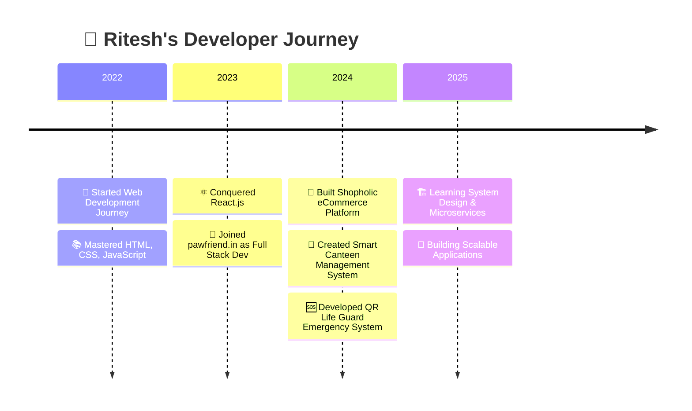

# <div align="center">👋 Hello , I am Ritesh Yadav!

> 🚀 Full Stack Developer ·  
> Creating magic with code, one project at a time.
</div>

<div align="center">
  
 [](https://git.io/typing-svg)


</div>

---

<div align="center">

```
    ╔══════════════════════════════════════════════════════════╗
    ║  🚀 RITESH YADAV | Crafting Tomorrow's Web Today 🚀     ║
    ╚══════════════════════════════════════════════════════════╝
```

</div>

## 🎭 **The Developer Behind The Code**

<table>
<tr>
<td width="50%">

```yaml
🧑‍💻 Developer Profile:
  name: "Ritesh Yadav"
  role: "Full Stack Architect"
  location: "🇮🇳 India"
  status: "Building the Future"
  
🎯 Mission Statement:
  - Transform ideas into digital reality
  - Solve complex problems elegantly  
  - Create seamless user experiences
  
🔥 Current Focus:
  - Microservices Architecture
  - System Design Mastery
  - Performance Optimization
```

</td>
<td width="50%">


</td>
</tr>
</table>

---

## 🛠️ **Arsenal of Technologies**

<div align="center">

### 🎨 Frontend Mastery


### ⚡ Backend Power


</div>

---

## 🎪 **Featured Creations**

<div align="center">

| 🎯 Project | 🔥 Impact | 🛠️ Tech Stack | 🔗 Links |
|------------|-----------|---------------|----------|
| **🛒 Shopholic** | Complete eCommerce ecosystem with admin panel & payment gateway | Next.js, Node.js, MongoDB | [🔍 Explore](https://github.com/riteshyadavanshi/shopholic) |
| **🍴 Smart Canteen** | QR-based ordering system with real-time kitchen dashboard | React, Node.js, Socket.io | [🔍 Explore](https://github.com/riteshyadavanshi/canteen-management) |
| **🆘 QR Life Guard** | Emergency data pendant for specially-abled individuals | React, Express, MongoDB | [🔍 Explore](https://github.com/riteshyadavanshi/qr-pendant) |

</div>

---

## 📈 **Developer Analytics**

<div align="center">


</div>

<div align="center">

[](https://git.io/streak-stats)

</div>

---

## 🎯 **Evolution Timeline**



---

## 🌐 **Connect & Collaborate**

<div align="center">

<table>
<tr>
<td align="center" width="33%">

### 💼 Professional
[](https://riteshyadavanshi.github.io/portfolio/)
[](https://www.linkedin.com/in/ritesh-yadav-560496247/)

</td>
<td align="center" width="33%">

### 📬 Contact
[](mailto:riteshyadav4122@gmail.com)
[](https://github.com/riteshyadavanshi)

</td>
<td align="center" width="33%">

### 🤝 Collaborate
[](#)
[](#)

</td>
</tr>
</table>

</div>

---

<div align="center">

## 💫 **Philosophy**

```javascript
const riteshYadav = {
    mindset: "Growth over Perfection",
    approach: "Code with Purpose, Design with Passion",
    belief: "Every bug is a learning opportunity",
    goal: "Making the web more beautiful, one commit at a time"
};

console.log("Ready to build something amazing together? 🚀");
```

</div>

---

<div align="center">

### 🎉 **Fun Fact**
*I celebrate every GitHub contribution with cake! 🍰*

**"Building bridges between ideas and reality, one line of code at a time."**

[](https://github.com/riteshyadavanshi)

</div>

---

<div align="center">

### 🌟 *Thank you for visiting my digital space!* 🌟
*Let's create something extraordinary together!*

</div>
