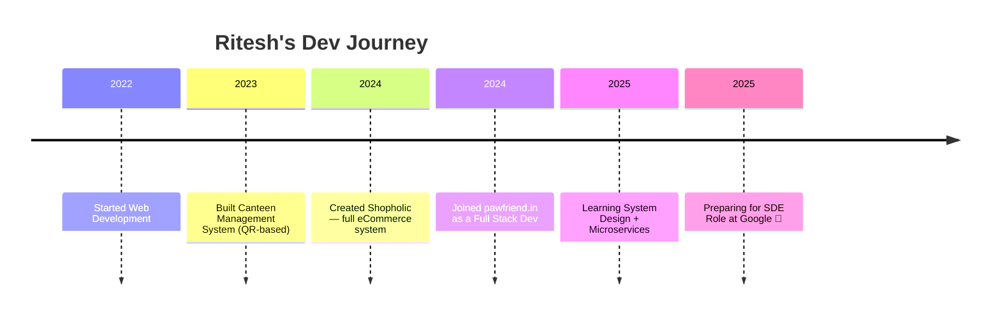

# 👋 Hello, I'm Ritesh Yadav!

> 🚀 Full Stack Developer · 🧠 JavaScript Wizard · 🌐 Digital Craftsman  
> Creating magic with code, one project at a time.

[](https://git.io/typing-svg)

---

## 🏷️ Who Am I?

```yaml
Name: Ritesh Yadav
Role: Full Stack Developer
Location: 🌍 India
Code_Stack: Next.js, React.js, Node.js, MongoDB, Tailwind CSS
Experience: Freelancing | Pawfriend.in | Open Source
Currently: Building Microservices & Micro-Frontends
```

🧠 I'm curious by nature, always on the hunt for better logic, better UI, and better performance.  
🥳 I love celebrating little wins — including cutting cake for GitHub contributions.

---

## 🛤️ Journey So Far



---

## 💼 Tech Stack I Love


---

## 🚧 Featured Projects

| Project | Description |
|--------|-------------|
| 🛒 [Shopholic](https://github.com/riteshyadavanshi/shopholic) | Full-stack eCommerce site with admin, payment, subcategories |
| 🍴 [Canteen System](https://github.com/riteshyadavanshi/canteen-management) | QR-based ordering + kitchen dashboard |
| 🧠 [QR Pendant](https://github.com/riteshyadavanshi/qr-pendant) | For specially-abled emergency data |
| 🧩 [Micro Frontend System](https://github.com/riteshyadavanshi/microfrontend-app) | Next.js MFE with reverse proxy and server actions |

---

## 📊 GitHub Stats


---

## 🌐 Let's Connect

- 🌐 Portfolio: [riteshdev.vercel.app](https://riteshyadavanshi.github.io/portfolio/)
- 💼 LinkedIn: [ritesh-yadav](https://www.linkedin.com/in/ritesh-yadav-560496247/)
- 📬 Email: riteshyadav.dev@gmail.com

---

## 💬 Life Motto

> _"Code like it's your last day, debug like it's your first."_ 💻

_Thanks for visiting my profile — let's build something awesome together!_
